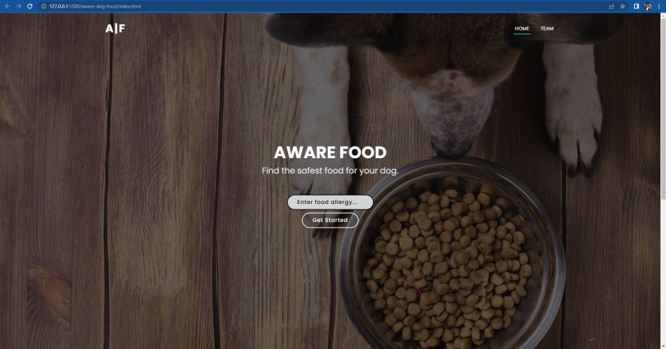
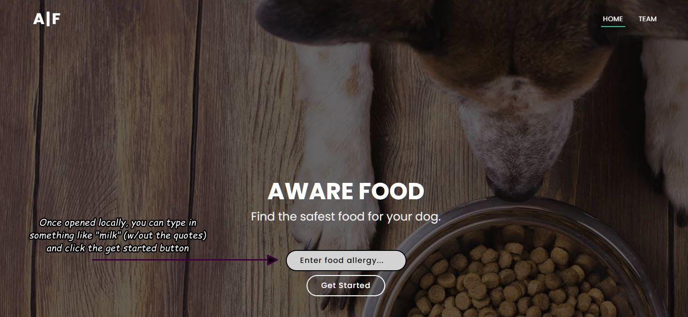
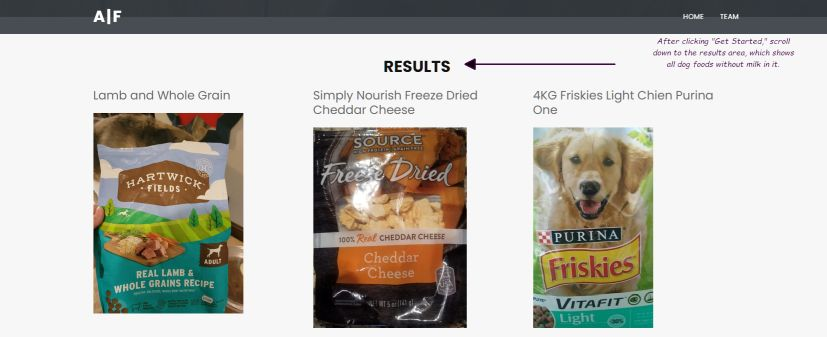

<!-- PROJECT LOGO -->



<!-- TABLE OF CONTENTS -->
<details>
  <summary>Table of Contents</summary>
  <ol>
    <li>
      <a href="#about-the-project">About The Project</a>
      <ul>
        <li><a href="#built-with">Built With</a></li>
      </ul>
      <a href="#getting-started">Getting Started</a>
    </li>
    </li>
    <li><a href="#acknowledgments">Acknowledgments</a></li>
  </ol>
</details>

<!-- ABOUT THE PROJECT -->

## About The Project

<!--this is just a quick snippet, but we can fine tune it later.-->

Aware is an easy-to-use single page reverse-search application built for our Mod 3 school project. Users can enter an ingredient their dog cannot consume and the results provide all dog foods available without the allergen.

### Built With

- [![Bootstrap][bootstrap.com]][bootstrap-url]
- [![CSS][css.com]][css-url]
- [![HTML][html.com]][html-url]
- [![JavaScript][javascript.com]][javascript-url]

### Getting Started

You can test out this project locally by cloning the repository.

```sh
git clone https://github.com/Michael-Grisso/aware-dog-food.git
```

### Usage

We tried make the UX as easy as possible. Here are a few quick examples on how to use:



Then:



<!-- LICENSE -->

### License

Distributed under the MIT License. See `LICENSE.txt` for more information.

<!-- ACKNOWLEDGMENTS -->

### Acknowledgments

- [adam-p Markdown Language Cheat Sheet](https://github.com/adam-p/markdown-here/wiki/Markdown-Cheatsheet)
- [GitHub docs](https://docs.github.com/en)
- [MDN Fetch API Docs](https://developer.mozilla.org/en-US/docs/Web/API/Fetch_API)
- [othneildrew Best README Template](https://github.com/othneildrew/Best-README-Template)
- [Stack Overflow](https://stackoverflow.com/)
- [W3 Schools](https://www.w3schools.com/)

<!-- HELP LINKS & IMAGES -->

[bootstrap.com]: https://img.shields.io/badge/Bootstrap-563D7C?style=bootstrap&logoColor=white
[bootstrap-url]: https://bootstrapmade.com/regna-bootstrap-onepage-templat
[css.com]: https://img.shields.io/badge/CSS-FF0000?style=css&logoColor=white
[css-url]: https://developer.mozilla.org/en-US/docs/Web/CSS
[html.com]: https://img.shields.io/badge/HTML-302683?style=HTML%20Academy&logoColor=white
[html-url]: https://www.w3schools.com/html/
[javascript.com]: https://img.shields.io/badge/JavaScript-FFD700?style=javascript&logoColor=black
[javascript-url]: https://developer.mozilla.org/en-US/docs/Web/JavaScript
